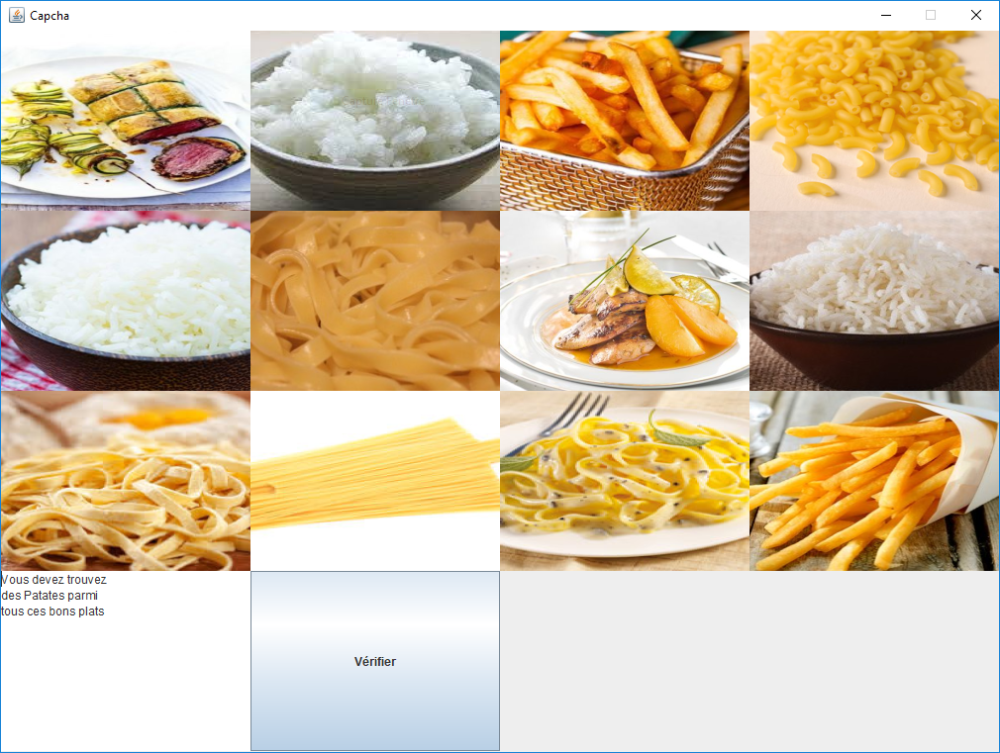

# Images Captcha in Java - Pasta, rice and potatoes (fr)



Images selection captcha in JAVA with difficulty management (image accuracy).
Text in French only.

## TO RUN

If you want to run the software directly without compiling, you have to execute 
the `captcha.jar` file by double clicking on it or by executing the following command:
```
java -jar captcha.jar
```

## TO BUILD

### 1. Compile it
#### Linux
```
find . -name "*.java"  -print | xargs javac -d bin 
```

#### Windows
```
for /f %i in ('forfiles /s /m *.java /c "cmd /c echo @relpath"') do @echo %~i >> sources.txt
javac @sources.txt -d bin 
```

### 2. Copy resources
You have to copy the resources from `/src` into `/bin` that the program can access to images :

#### Linux
```
rsync -avz --exclude '*.java' ./src/ ./bin/
```

#### Windows
```
xcopy .\src\* .\bin\ /S /I /C /Exclude:sources.txt
```

### 3. Execute
```
java -cp bin fr.upem.captcha.ui.MainUi
```


### 4. Build the .jar file 
```
jar cvfe captcha.jar fr.upem.captcha.ui.MainUi -C bin/ .
```
